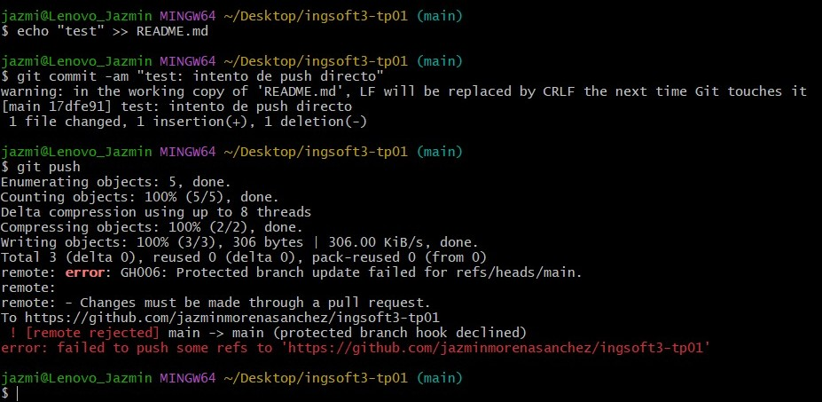
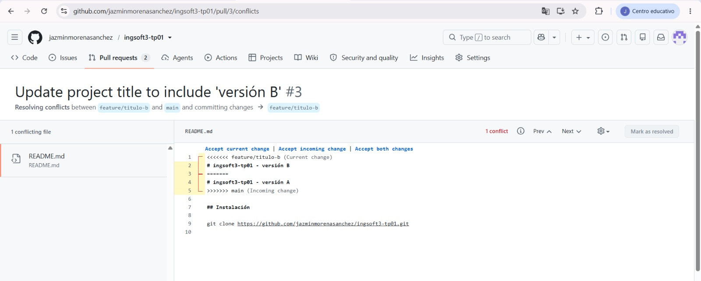

# Evidencias — TP1

## 1. Push directo a main rechazado

GitHub rechaza el push directo porque la rama `main` está protegida y la regla también alcanza al dueño del repositorio.

## 2. Conflicto en el PR de la rama B

GitHub detecta un conflicto entre las ramas A y B porque ambas modificaron la misma línea del README.

## 3. Marcadores del conflicto

GitHub muestra los marcadores del conflicto con las dos versiones de la línea. elegimos luego solo una versión.

## 4. Release v1.0.0 publicada

Se muestra la release `v1.0.0` publicada a partir del tag creado para la primera versión del TP.